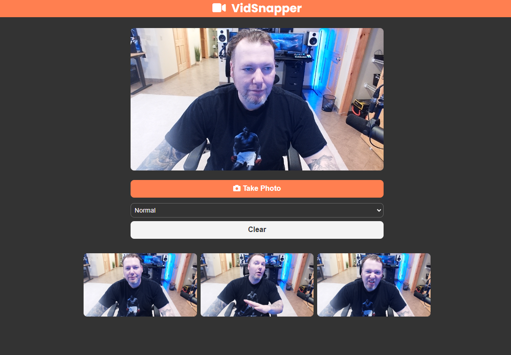

# VidSnapper

> Webcam filter and picture app built on WebRTC getUserMedia and canvas

## App Info

### Author

Brad Traversy
[Traversy Media](http://www.traversymedia.com)

### Version

1.0.1

### License

This project is licensed under the MIT License
